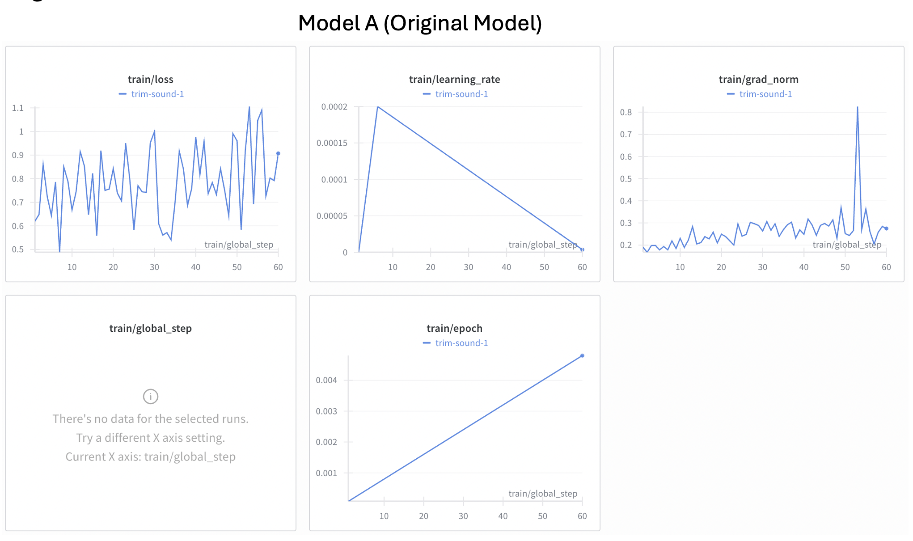
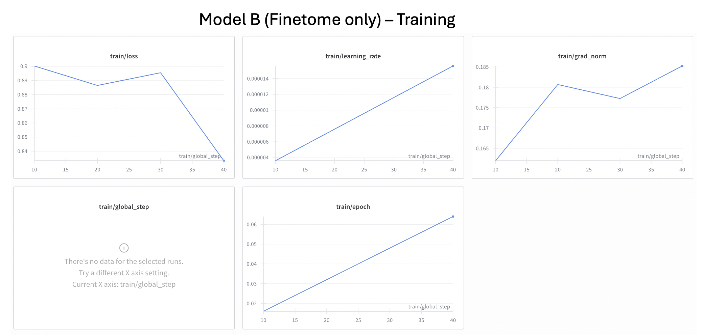
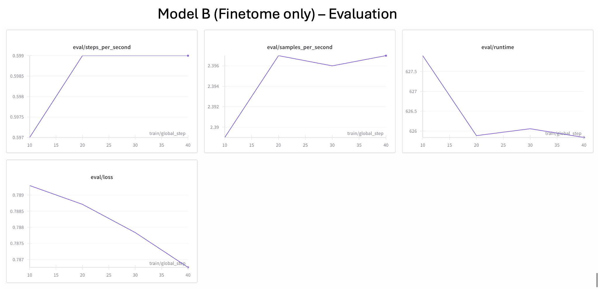
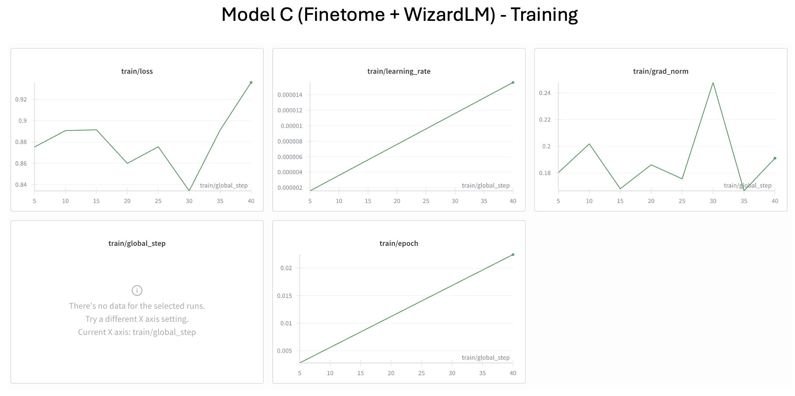
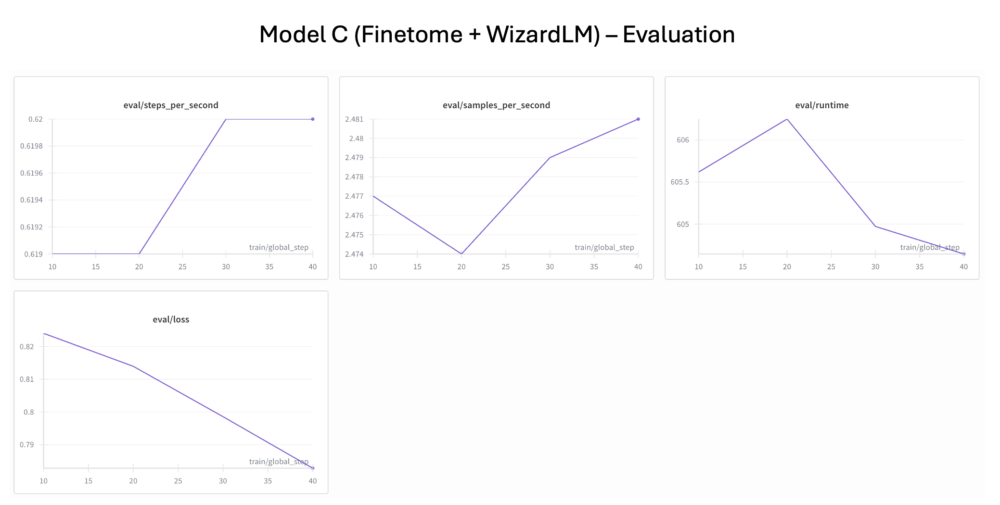

# Fine-Tuning Llama-3.2-3B-Instruct for Enhanced Conversational AI

This project focuses on fine-tuning the **`unsloth/Llama-3.2-3B-Instruct`** model with the Unsloth library. It uses LoRA and QLoRA to improve the model’s ability to follow instructions and hold conversations. Also, context was given to the LLM in order to increase conversation capability. 

For evaluation and optimization, three models were studied and compared:

1.  **Model A (Original Template)**: Original model provided in the template, serving as a baseline for early fine-tuning performance
2.  **Model B (Optimized FineTome)**: The LLM was fine-tuned according to the optimal hyperparameters shown below exclusively on the `FineTome-100k` dataset. Crucially, this model incorporated an evaluation stage (train/test split) to monitor validation loss.
3.  **Model C (Optimized + Context)**: This model used the same optimized fine-tuning hyperparameters as Model B but added conversational context by merging the `FineTome-100k` dataset with the `WizardLM_evol_instruct_70k` dataset.

The main objective was to optimize speed and efficiency for chatbot applications. 


## Setup and Environment

The fine-tuning was performed on a free Tesla T4 Google Colab instance using the Unsloth framework for acceleration and reduced memory footprint.

### Dependencies

The following core libraries were installed and used:

```bash
!pip install unsloth
!pip uninstall unsloth -y && pip install --upgrade --no-cache-dir --no-deps git+https://github.com/unslothai/unsloth.git@nightly git+https://github.com/unslothai/unsloth-zoo.git
```

### Model Configuration

| Parameter | Value | Explanation |
| :--- | :--- | :--- |
| **Base Model** | `unsloth/Llama-3.2-3B-Instruct` | This base model was selected for its speed and efficiency. It is great balance between 1B and 3B models, suitable for simple chatbot tasks. |
| **`max_seq_length`** | 2048 | The maximum length of the input sequence was set to 2048 for the model for the model to handle longer conversations and have a better reasoning. |
| **`dtype`** | `None` (auto-detected) | Automatically set to Float16 for Tesla T4. |
| **`load_in_4bit`** | `True` | Uses 4-bit quantization (QLoRA) to significantly reduce VRAM usage. |

## Data Preparation

### Datasets Used

The models were trained on a mix of data:
1. **Model A** used `mlabonne/FineTome-100k $\approx 100,000$ samples
2. **Model B** used `mlabonne/FineTome-100k`: $\approx 15,000$ samples.
3. **Model C** used a blend of +mlabonne/FineTome-100k` $\approx 15,000$ samples and `WizardLMTeam/WizardLM_evol_instruct_70k` $\approx 15,000$ samples to increase the model's conversational capability.

Furthermore, the mixed dataset was divided into a 95% training and 5% test. 
*The testing percentage is low to use less memory since Google Colab has limited credits for the usage of TeslaT4.*

### Train/Test Split (Evaluation Stage)

To enable accurate monitoring and feedback during fine-tuning, Model B and Model C incorporated a training evaluation stage. The initial dataset was split into a training set (95%) and a small test set (5%) to be used as the evaluation set. The testing percentage was set low to ensure faster iteration and due to the limited credits of TeslaT4 in Google Colab. 

The test set allowed for the evaluation stage during training, providing metrics like validation loss (`eval/loss`) to assess how well the model was generalizing and improving compared to a non-evaluated model. 


### Formatting

The datasets were standardized to the Llama-3.1-Instruct chat template:

```
<|begin_of_text|><|start_header_id|>system<|end_header_id|>

Cutting Knowledge Date: December 2023
Today Date: 26 July 2024

<|start_header_id|>user<|end_header_id|>

[USER_INPUT]<|eot_id|><|start_header_id|>assistant<|end_header_id|>

[MODEL_RESPONSE]<|eot_id|>
```

  * **`unsloth.chat_templates.standardize_sharegpt`**  converted the source data format.
  * **`train_on_responses_only`** was applied to ensure the model only calculated the loss on the assistant's output, and not on the user's input. This made training more efficient.


## Fine-Tuning with SFTTrainer

The training was performed using Hugging Face TRL's `SFTTrainer` with modified hyperparameters to optimize performance.

### Callbacks and W\&B

The training process incorporated a custom callback and Weights & Biases (W\&B) integration for enhanced control, monitoring, and visualization. A callback is an object that executes code at various stages of the training process.

  * **Custom `checkpointcallback`**: This custom callback was implemented to perform two critical actions automatically:
    1.  Model Checkpointing: It monitors the `train/loss` and automatically saves the best performing LoRA adapter weights to Google Drive when a new lowest loss is achieved.
    2.  Live Inference: At the end of each epoch, the system performs a live qualitative test by selecting a random prompt from a predefined evaluation list. The model’s response is printed directly to the logs.
  * **W\&B Integration**: W\&B was used to visualize all experiment metrics in real-time. The `report_to="wandb"` argument in `TrainingArguments` automatically sends all training results to the API.

### Training Hyperparameters

| Hyperparameter | Value | Explanation |
| :--- | :--- | :--- |
| **`per_device_train_batch_size`** | 4 | The number of samples processed per GPU in a single forward/backward pass. To speed up training, it was increased from 2 to 4. |
| **`gradient_accumulation_steps`** | 4 | The number of forward/backward passes before an optimization step. Set to achieve an batch size of 16 (4 \* 4) given the 16 GB VRAM constraint on the Tesla T4. |
| **`max_steps`** | 40 | Reduced from 60 to prevent overfitting, preserve the model's general abilities, and allow a faster iteration loop. |
| **`learning_rate`** | $2 \times 10^{-5}$ | Decreased from the common default of $1 \times 10^{-4}$ to avoid instability and overfitting, especially in the early training steps. |
| **`warmup_steps`** | 50 | The number of steps over which the learning rate increases from 0. It was increased to prevent divergence and "hallucinations" early in training by allowing the model to adapt smoothly. |
| **`optim`** | `"adamw_8bit"` | An optimizer that keeps the full state and quantizes it, offering low precision but significant memory savings. |
| **`weight_decay`** | 0.01 | Coefficient for L2 regularization, helps prevent the model from memorizing training data during fine-tuning. This value will help the model to prevent overfitting, improve stability during training, and improve generalization to long sequences|
| **`lr_scheduler_type`** | `"linear"` | Defines the learning rate schedule, linearly decreasing the rate from the initial value down to zero over training steps. This will help the model to  converge smoothly without oscillations, reduce forgetting, and stabilizes training.|
| **`logging_steps`** | 10 | The interval at which training loss is reported. Incremented from 1 to track loss without "spamming" the console output. |
| **`eval_strategy`** | `"steps"` | The model is evaluated every `logging_steps` (10 steps) to continuously track its performance on a small test set. The evaluation   |

*These hyperparameters were used for Model A and B*

## Model Evaluation

The following graphs illustrate the performance for each model:

**Model A (Original Model)**


**Training Results**
* 394.6114 seconds used for training.
* 6.58 minutes used for training.
* Peak reserved memory = 4.617 GB.
* Peak reserved memory for training = 1.547 GB.
* Peak reserved memory & of max memory = 31.321 %.
* Peak reserved memory for training & of max memory = 10.495.


**Model B (Finetome only)**



**Training Results**
* 3053.7868 seconds used for training.
* 50.9 minutes used for training.
* Peak reserved memory = 7.508 GB.
* Peak reserved memory for training = 3.184 GB.
* Peak reserved memory % of max memory = 50.933 %.
* Peak reserved memory for training % of max memory = 21.6 %.

**Model C (Finetome + WizardLM)**



**Training Results**
* 2975.0112 seconds used for training.
* 49.58 minutes used for training.
* Peak reserved memory = 7.967 GB.
* Peak reserved memory for training = 0.461 GB.
* Peak reserved memory % of max memory = 54.047 %.
* Peak reserved memory for training % of max memory = 3.127 %.


The comparison of the model evaluation focuses on the three major factors: Performance (Eval Loss), Efficiency (Memory & Time), and Training Stability.

### 1. Performance and Efficiency Comparison

| Metric | Model A | Model B | Model C (Finetome + WizardLM) |
| :--- | :--- | :--- | :--- |
| **Training Loss (Final)** | Highly volatile | $0.84$ (Smoothest decline) | $\approx 0.93$ (Volatile peak) |
| **Evaluation Loss (Final)** | - | $\approx 0.787$| $\approx 0.780$ (Lowest overall) |
| **Total Data Size** | $\approx 100,000$ samples | $\approx 30,000$ samples | $\approx 30,000$ samples |
| **Peak VRAM for Training** | $1.547 \text{ GB}$ ($\approx 10.5\%$) | $3.184 \text{ GB}$ ($\approx 21.6\%$) |$0.461 \text{ GB}$ ($\approx 3.13\%$) (Lowest overall) |
| **Total Training Time** | $6.58 \text{ minutes}$ | $50.9 \text{ minutes}$ | $49.58 \text{ minutes}$ |


### 2. Analysis

1.  **Highest Performance**: Model C delivered the lowest evaluation loss ($\approx 0.780$). Because evaluation loss reflects how well a model generalizes to unseen data, a lower score signals stronger conversational quality and overall performance. This outcome highlights the advantage of incorporating context into a LLM to generalize and follow complex instructions.
2.  **Efficiency**: Model C used only **$0.461 \text{ GB}$** of peak VRAM during training, compared to $3.184 \text{ GB}$ for Model B. This shows that the final configuration optimized  memory-saving.
3.  **Stability Analysis**: Model B's $\text{train/loss}$ curve shows a consistently smooth decline, while Model C's curve is more volatile, showing a sharp rise toward the end (peaking at $\approx 0.93$ at step 40). This suggests Model B had more stable training. However, instability does not always mean worse performance; in this case, the Model C's better evaluation loss indicates the spikes did not harm its final quality on the test set.

In conclusion, Model C (Fine-tune model with context added) is the best choice, demonstrating superior performance and resource efficiency.

## Inference and Deployment (Web App)

The trained LoRA adapters were integrated with the base model and deployed as a conversational web application using Gradio. This deployment focuses on demonstrating interactive chat capabilities.

### Deployment Details

  * **Web Framework**: Gradio
  * **Model Loading**: The model is explicitly configured to run on the CPU (`device = "cpu"`) for broader compatibility, even if it results in slower inference.
      * The *Base Model* (`unsloth/Llama-3.2-3B-Instruct`) is loaded into `torch.float32` and mapped directly to the CPU.
      * The *LoRA adapter* (`Ana8413/model_02dec_lora`) is loaded and moved to the CPU.

### Adjustable Inference Hyperparameters in the User Interface

The Gradio interface enables the user to adjust: *Temperature, Top-p (Nucleus Sampling), and Max New Tokens*  for real-time model behavior tuning.

### Launch Command

The Gradio interface is launched with the command:

```python
# The final line of the app.py script
.launch()
```

This is the link to our space in Hugging Face: https://huggingface.co/spaces/Klariiii/Lab2_llama3.2-3b-q4k-finetome-wizardlm
